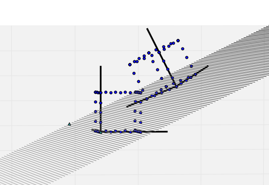

I love when someone asks me to provide them with some math help on a real-world problem. New London (CT) maker extraordinaire Mike Molinari recently sent me this message:

> Hey.
I have another math thing I am working on.
any chance you might be able to spare a few minutes and give me a hand?
It has to do with translation of 3d points.
...just need a bit of help to figure it out.

Mike explained the problem over the phone. What it boiled down to was that he:
1. was finding the coordinates of three points on a plane we'll call **T**
2. had the coordinates of points in some 3D object (e.g. a box) relative to the standard coordinate axes **i**, **j**, and **k**.
3. wanted to compute the coordinates of the points in the object relative to the coordinate axes and origin of the plane **T**.

For example, if given the points defining the cube to the lower left in the figure, and 3 points defining the plane that is graphed, the function should output the coordinates for the cube plotted in the upper right.

...

Later I wrote back to Mike:
> I’m turning it into an assignment in my programming class for my students. As such I’ve refined the code a bit in case you want that. Also, was wondering why you needed this. Would help me motivate the lesson for the students. Thanks for the challenge.
